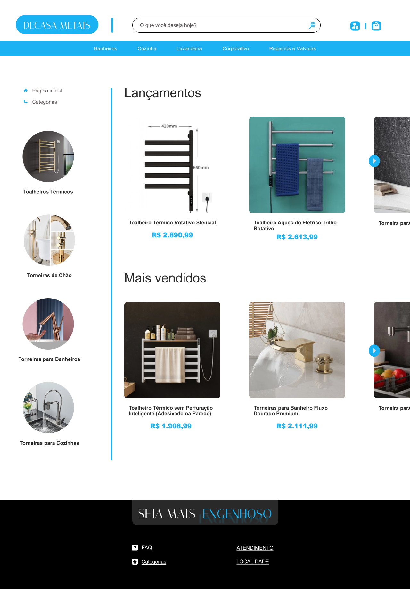
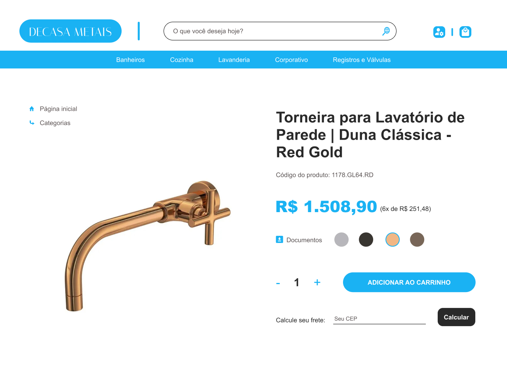
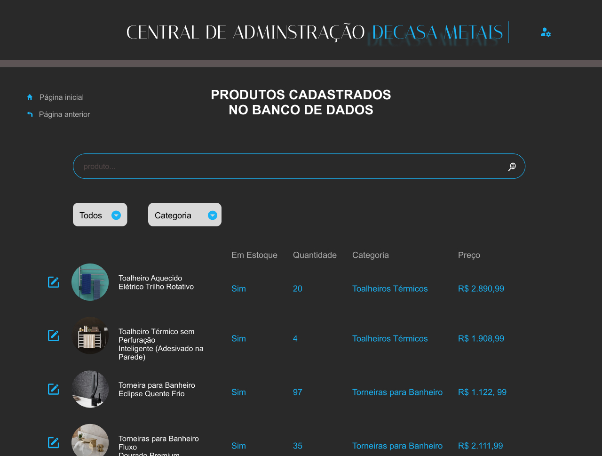

Esse projeto não possui link, pois, precisaria que o **servidor** estivesse rodando para retornar os dados em tela. Por conta disso, só podemos ver um print de como é o projeto quando o **servidor** está rodando.

 

### Página Inicial
----

 

### Página para Comprar Produto
----

 

### Página para Adminstradores
----

